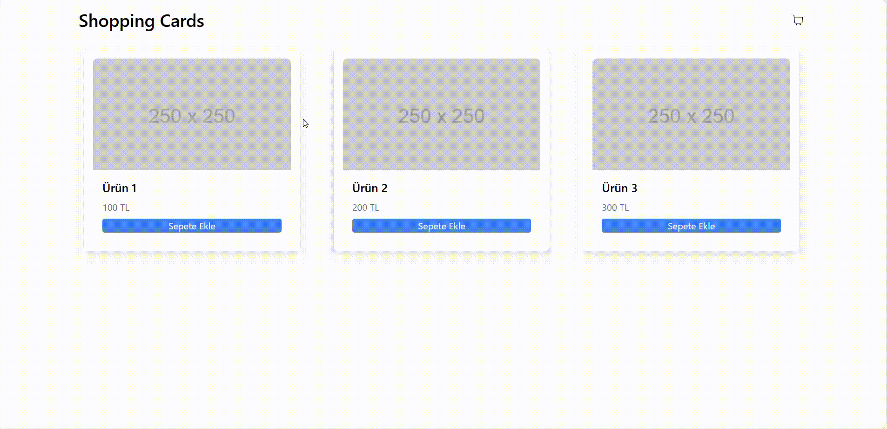

## Sepet Uygulaması

Bu proje, React kullanılarak geliştirilmiş bir sepet uygulamasıdır. Proje, modern bir kullanıcı arayüzü için Tailwind CSS, ikonlar için React Icons ve hızlı geliştirme ortamı için Vite kullanılarak oluşturulmuştur.

## Özellikler

- Ürün Listesi: Kullanıcılar mevcut ürünleri görebilir.

- Sepete Ekle: Her ürüne ait bir “Sepete Ekle” butonu ile ürünler sepete eklenebilir.

- Sepet Görüntüleme: Sepet içeriği görüntülenebilir ve güncellenebilir.

## Kullanılan Teknolojiler

React: Kullanıcı arayüzünün oluşturulması.

Tailwind CSS: Stil ve tasarım.

React Icons: Uygulamada ikonların kullanımı.

Vite: Hızlı geliştirme ortamı.

## Gif

